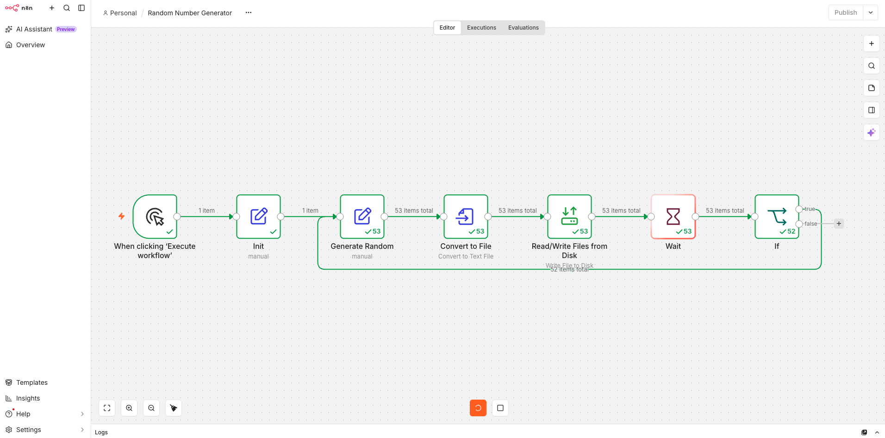

# n8n — How-To Guide

**Purpose:** a practical, step-by-step operational reference for working with n8n on this Mac — the "how." (`Automation_n8n.md`, in the planning-docs project, is the "what and why": use case tracker, decisions, roadmap. This file lives here in the repo so it travels with the actual workflow exports it documents.)

**Status:** living document — started 2026-09-04, filled in as we go rather than written all at once.

---

## Starting and stopping n8n

```bash
# Start (detached)
cd ~/n8n
docker compose up -d

# Check status — confirm 127.0.0.1:5678 is listed under PORTS
docker ps

# Open the editor — use Chrome, not Safari
# http://localhost:5678

# Stop for the day
cd ~/n8n
docker compose down
```

If you've changed `docker-compose.yml` (new volume, new env var, etc.), `docker compose restart` is **not** enough — it just restarts the existing container as-is, without re-reading the file. Use `docker compose up -d` instead; Compose detects the config change and recreates the container. Either way, data in `~/n8n/data/` is untouched.

## Creating a new workflow

1. Open Chrome to http://localhost:5678.
2. From the Overview page, click **+ Add workflow** (top-right).
3. Click the title at the top of the new blank canvas and rename it to something meaningful.
4. The blank canvas shows an empty box with **Add first step...** underneath it — click it to open the node picker, and start adding nodes. See the worked example below for a complete build.

## Docker volumes reference

| Host path | Container path | Purpose |
|---|---|---|
| `~/n8n/data/` | `/home/node/.n8n` | n8n's own internal state — workflows, credentials, execution history (encrypted SQLite). Don't write into this directly; it's n8n's, not yours. |
| `~/n8n/output/` | `/data/output` | Added 2026-09-04. General-purpose area for workflows to write files into. Give each workflow its own subfolder (e.g. `output/random-number/`) — a new subfolder doesn't need a docker-compose edit or restart, only a brand-new top-level mount does. |

Only folders listed under `volumes:` in `docker-compose.yml` are visible to the container — nothing else on the Mac is reachable from inside it, and nothing inside the container is visible on the Mac, in either direction.

## Installing Docker and n8n (TODO — to expand here)

Already done, and documented at a high level in the "Home Computers Management" project's `MacBook_Air_Software.md` (Section 11) — security decisions, pre-install checklist, install narrative. Bring the detailed step-by-step over into this file later, so this repo is self-contained for anyone (including future-Oscar) who wants to reproduce the setup without needing the other project's docs.

## Random Number Generator workflow

The first real trigger-based workflow, built end to end on 2026-09-04. Design rationale is in `Automation_n8n.md`, Section 7 (planning-docs project); this section is the practical build steps.

**What it does:** click a button, and a file on disk gets overwritten with a fresh random two-digit number every 5 seconds, for up to 15 minutes, then it stops itself automatically (or you can stop it early by hand).

**Nodes, in order:**

1. **Manual Trigger** ("When clicking 'Execute workflow'") — starts the run.
2. **Edit Fields (Set)**, renamed **"Init"** — Manual Mapping mode. One field: `startTime`, Type **Number**, Value (as an expression): `{{ $now.toMillis() }}`. Captures the moment the run started, as a plain millisecond count — this is what makes the 15-minute fail-safe possible later.
3. **Edit Fields (Set)**, renamed **"Generate Random"** — one field: `randomNumber`, Type **String** (not Number — a String preserves a leading zero, e.g. `07`, which a Number type would silently drop), Value: `{{ Math.floor(Math.random() * 100).toString().padStart(2, '0') }}`.
4. **Convert to File** — Operation **"Convert to Text File"**. Text Input field: `randomNumber`. Put Output File in Field: `data` (the default — matters because the next node expects a binary field with that exact name). Options > File Name: `random-number.txt`. This node exists because "Write File to Disk" only accepts binary data, not a plain JSON field, so this converts our text into a binary "file" object first.
5. **Read/Write Files from Disk** — Operation **"Write File to Disk"**. File Path and Name: `/data/output/random-number/random-number.txt` (the container-side path — maps to `~/n8n/output/random-number/` on the Mac via the bind mount). Input Binary Field: `data`. **Needs `N8N_RESTRICT_FILE_ACCESS_TO=/data/output` set in `n8n.secrets.env`** — see Troubleshooting below.
6. **Wait** — Resume: "After Time Interval". Amount: `5`. Unit: **Seconds**. This is the rhythm — how often the number changes.
7. **If** — one condition: Value 1 (type **Number**): `{{ $now.toMillis() - $('Init').item.json.startTime }}` (elapsed milliseconds since the run started — note it reaches back to the "Init" node by name explicitly, rather than assuming the field tagged along through every node in between). Operator: **"is smaller than"**. Value 2: `900000` (15 minutes, in milliseconds). This is the duration cap — separate from, and not to be confused with, the 5-second Wait above.
8. **Loop it back:** drag a connection from the If node's **true** output to the **input** of "Generate Random" (step 3) — this is what turns the chain into an actual loop rather than a one-shot. Leave **false** unconnected; that's what lets the run end cleanly once 15 minutes are up.

Result, mid-run (53 cycles in, still looping):



**Status: Working**, verified 2026-09-04 — ran live, looped dozens of cycles automatically, file confirmed updating on disk each cycle.

---

## Change log

- 2026-09-04 — file created. Documented start/stop commands and the docker volumes in use. "Creating a new workflow" and "Installing Docker and n8n" sections are stubs, to fill in as we go.

## Troubleshooting

### "Access to the file is not allowed" (Read/Write Files from Disk node)

**Symptom:** the "Write File to Disk" operation fails with `Access to the file is not allowed.`, even though the target path is inside a folder that's correctly bind-mounted into the container.

**Cause:** as of n8n 2.x, filesystem-touching nodes enforce an allow-list by default (`N8N_RESTRICT_FILE_ACCESS_TO`) — this is a breaking change from pre-2.0 behavior, where file access was unrestricted unless you explicitly locked it down. Leaving the variable unset in 2.x does *not* mean unrestricted; it defaults to restrictive.

**Fix:** explicitly allow the folder your workflows write to, in `n8n.secrets.env`:

```
N8N_RESTRICT_FILE_ACCESS_TO=/data/output
```

(Multiple paths are separated by semicolons `;`, not commas.) Then apply it with `docker compose up -d` (not `restart` — see the note above about why).

